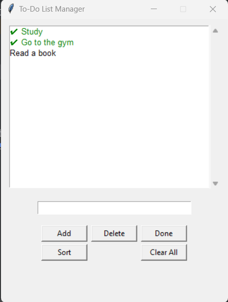

# 📝 To-Do List / Task Manager (Tkinter GUI)

A minimal yet functional **To-Do List desktop application** built with **Python** and **Tkinter**.  
This app allows users to easily add, remove, and manage their daily tasks through a clean graphical interface.

---

## 🚀 Features
- 🆕 Add new tasks instantly  
- ✅ Mark tasks as completed  
- 🗑️ Delete selected tasks  
- 💾 Save tasks automatically  
- 🖥️ Simple and responsive interface built with Tkinter  

---

## 🧠 Technologies Used
- **Python 3.x**
- **Tkinter** (for GUI)
- **PyInstaller** (for building the `.exe` version)

---

## 📂 Project Structure
To-Do List/
* │
* ├── To_Do_List.py # Main Python source code
* ├── dist/ # Folder containing the built .exe file
* ├── build/ # Temporary files created during build
* └── README.md # Documentation file


---

## ⚙️ How to Run
### 🪟 Option 1: Run from source
1. Make sure you have **Python 3.10+** installed.  
2. Open a terminal in the project directory.  
3. Run:
   ```bash
   python To_Do_List.py
   
## 💻 Option 2: Run the compiled app

1. Open the dist/ folder.
2. Double-click the To_Do_List.exe file to launch the app.
---
📸 Screenshots



---
## 🧑‍💻 Author

**allam redhwane doc**

Built for learning and portfolio demonstration.
---
## 🪶 License

This project is open for educational and personal use.

Feel free to explore, modify, and improve it — just don’t remove credits 😉.
